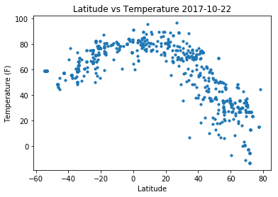
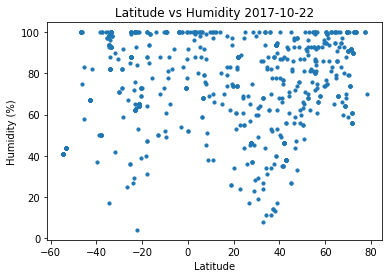
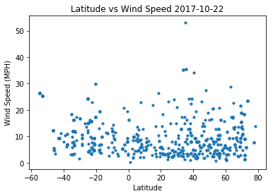
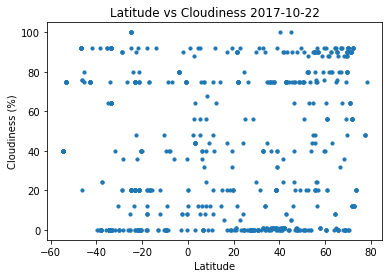

# Temperature increases for locations closer to the equator and decreases closer to the poles, as expected.
# There are more locations of lower humidity farther from the equator than nearer (no registered value of lower than 40% near the equator), and a greater concentration of locations with higher humidity near the equator.
# Cloudiness values are well distributed near the equator, but less so away - there are several more locations of low cloudiness outside of the -20 to 20 latitude range.


```python
#set dependencies
import json
import requests as req
import pandas as pd
import numpy as np
import random as rd
import matplotlib.pyplot as plt
from citipy import citipy
from requests_toolbelt.threaded import pool
```


```python
g = {"lat":[],"lon":[]}
h = {}
```


```python
coor = pd.DataFrame(g)
ci = pd.DataFrame(h)
ci["City"] = ""
ci
```


<div>
<style>
    .dataframe thead tr:only-child th {
        text-align: right;
    }

    .dataframe thead th {
        text-align: left;
    }

    .dataframe tbody tr th {
        vertical-align: top;
    }
</style>
<table border="1" class="dataframe">
  <thead>
    <tr style="text-align: right;">
      <th></th>
      <th>City</th>
    </tr>
  </thead>
  <tbody>
  </tbody>
</table>
</div>


```python
#generate coordinates from across the planet
for i in range(1,750):                 #Choose number of Lat Long to be generated

    u = float(rd.uniform(-90,90))

    v = float(rd.uniform(-180,180))
  
    coor.set_value(i, "lat", u)
    coor.set_value(i, "lon", v)
coor
```


<div>
<style>
    .dataframe thead tr:only-child th {
        text-align: right;
    }

    .dataframe thead th {
        text-align: left;
    }

    .dataframe tbody tr th {
        vertical-align: top;
    }
</style>
<table border="1" class="dataframe">
  <thead>
    <tr style="text-align: right;">
      <th></th>
      <th>lat</th>
      <th>lon</th>
    </tr>
  </thead>
  <tbody>
    <tr>
      <th>1</th>
      <td>83.120101</td>
      <td>-174.111256</td>
    </tr>
    <tr>
      <th>2</th>
      <td>-27.169442</td>
      <td>-35.576721</td>
    </tr>
    <tr>
      <th>3</th>
      <td>-64.227517</td>
      <td>153.879956</td>
    </tr>
    <tr>
      <th>4</th>
      <td>-24.006434</td>
      <td>94.559577</td>
    </tr>
    <tr>
      <th>5</th>
      <td>-7.763015</td>
      <td>150.117063</td>
    </tr>
    <tr>
      <th>6</th>
      <td>-48.397176</td>
      <td>-146.531380</td>
    </tr>
    <tr>
      <th>7</th>
      <td>78.658983</td>
      <td>142.699161</td>
    </tr>
    <tr>
      <th>8</th>
      <td>-70.439580</td>
      <td>-112.827654</td>
    </tr>
    <tr>
      <th>9</th>
      <td>-18.429835</td>
      <td>-38.185506</td>
    </tr>
    <tr>
      <th>10</th>
      <td>30.385327</td>
      <td>18.776417</td>
    </tr>
    <tr>
      <th>11</th>
      <td>-10.054002</td>
      <td>173.845863</td>
    </tr>
    <tr>
      <th>12</th>
      <td>-21.207217</td>
      <td>10.615439</td>
    </tr>
    <tr>
      <th>13</th>
      <td>-73.246998</td>
      <td>-79.806170</td>
    </tr>
    <tr>
      <th>14</th>
      <td>-9.856981</td>
      <td>166.386159</td>
    </tr>
    <tr>
      <th>15</th>
      <td>67.102836</td>
      <td>-11.692157</td>
    </tr>
    <tr>
      <th>16</th>
      <td>13.187517</td>
      <td>-75.422033</td>
    </tr>
    <tr>
      <th>17</th>
      <td>58.710361</td>
      <td>41.221344</td>
    </tr>
    <tr>
      <th>18</th>
      <td>82.882644</td>
      <td>149.675909</td>
    </tr>
    <tr>
      <th>19</th>
      <td>69.495233</td>
      <td>-96.121793</td>
    </tr>
    <tr>
      <th>20</th>
      <td>64.819098</td>
      <td>95.935069</td>
    </tr>
    <tr>
      <th>21</th>
      <td>-18.536703</td>
      <td>-40.978534</td>
    </tr>
    <tr>
      <th>22</th>
      <td>55.826551</td>
      <td>48.053948</td>
    </tr>
    <tr>
      <th>23</th>
      <td>-25.289593</td>
      <td>-46.905554</td>
    </tr>
    <tr>
      <th>24</th>
      <td>-31.933520</td>
      <td>101.595848</td>
    </tr>
    <tr>
      <th>25</th>
      <td>78.010894</td>
      <td>152.369980</td>
    </tr>
    <tr>
      <th>26</th>
      <td>4.160002</td>
      <td>-40.172354</td>
    </tr>
    <tr>
      <th>27</th>
      <td>-19.201715</td>
      <td>-28.177322</td>
    </tr>
    <tr>
      <th>28</th>
      <td>-57.151650</td>
      <td>-92.642974</td>
    </tr>
    <tr>
      <th>29</th>
      <td>66.905983</td>
      <td>12.709350</td>
    </tr>
    <tr>
      <th>30</th>
      <td>24.005473</td>
      <td>93.632704</td>
    </tr>
    <tr>
      <th>...</th>
      <td>...</td>
      <td>...</td>
    </tr>
    <tr>
      <th>720</th>
      <td>-88.131970</td>
      <td>17.388151</td>
    </tr>
    <tr>
      <th>721</th>
      <td>61.936692</td>
      <td>55.243647</td>
    </tr>
    <tr>
      <th>722</th>
      <td>50.087035</td>
      <td>-31.711485</td>
    </tr>
    <tr>
      <th>723</th>
      <td>24.048259</td>
      <td>79.596700</td>
    </tr>
    <tr>
      <th>724</th>
      <td>55.839355</td>
      <td>-121.340351</td>
    </tr>
    <tr>
      <th>725</th>
      <td>23.399613</td>
      <td>140.034852</td>
    </tr>
    <tr>
      <th>726</th>
      <td>77.227800</td>
      <td>21.328627</td>
    </tr>
    <tr>
      <th>727</th>
      <td>28.058369</td>
      <td>22.073044</td>
    </tr>
    <tr>
      <th>728</th>
      <td>59.093050</td>
      <td>-155.390203</td>
    </tr>
    <tr>
      <th>729</th>
      <td>16.869074</td>
      <td>-34.866950</td>
    </tr>
    <tr>
      <th>730</th>
      <td>-56.907769</td>
      <td>-128.745490</td>
    </tr>
    <tr>
      <th>731</th>
      <td>55.759018</td>
      <td>-135.146091</td>
    </tr>
    <tr>
      <th>732</th>
      <td>-74.223470</td>
      <td>-6.858392</td>
    </tr>
    <tr>
      <th>733</th>
      <td>40.932247</td>
      <td>-4.385451</td>
    </tr>
    <tr>
      <th>734</th>
      <td>7.485466</td>
      <td>-66.583532</td>
    </tr>
    <tr>
      <th>735</th>
      <td>88.024545</td>
      <td>-21.298357</td>
    </tr>
    <tr>
      <th>736</th>
      <td>83.792559</td>
      <td>63.067558</td>
    </tr>
    <tr>
      <th>737</th>
      <td>36.118276</td>
      <td>-85.858041</td>
    </tr>
    <tr>
      <th>738</th>
      <td>61.234033</td>
      <td>101.801607</td>
    </tr>
    <tr>
      <th>739</th>
      <td>-7.494013</td>
      <td>-2.691796</td>
    </tr>
    <tr>
      <th>740</th>
      <td>-42.729411</td>
      <td>-151.555657</td>
    </tr>
    <tr>
      <th>741</th>
      <td>39.463218</td>
      <td>35.003351</td>
    </tr>
    <tr>
      <th>742</th>
      <td>-53.414304</td>
      <td>-97.126020</td>
    </tr>
    <tr>
      <th>743</th>
      <td>-82.671704</td>
      <td>-58.842119</td>
    </tr>
    <tr>
      <th>744</th>
      <td>27.399167</td>
      <td>-156.006066</td>
    </tr>
    <tr>
      <th>745</th>
      <td>-22.434885</td>
      <td>124.145822</td>
    </tr>
    <tr>
      <th>746</th>
      <td>44.601378</td>
      <td>87.412576</td>
    </tr>
    <tr>
      <th>747</th>
      <td>-82.140446</td>
      <td>7.437269</td>
    </tr>
    <tr>
      <th>748</th>
      <td>-33.222687</td>
      <td>-106.026717</td>
    </tr>
    <tr>
      <th>749</th>
      <td>-44.046303</td>
      <td>-155.148406</td>
    </tr>
  </tbody>
</table>
<p>749 rows × 2 columns</p>
</div>


```python
#use citipy to find nearest city to each set of coordinates
for index, row in coor.iterrows():
    city = citipy.nearest_city(row["lat"],row["lon"])
    ci.set_value(index, "City", city.city_name)
    
ci
```


<div>
<style>
    .dataframe thead tr:only-child th {
        text-align: right;
    }

    .dataframe thead th {
        text-align: left;
    }

    .dataframe tbody tr th {
        vertical-align: top;
    }
</style>
<table border="1" class="dataframe">
  <thead>
    <tr style="text-align: right;">
      <th></th>
      <th>City</th>
    </tr>
  </thead>
  <tbody>
    <tr>
      <th>1</th>
      <td>mys shmidta</td>
    </tr>
    <tr>
      <th>2</th>
      <td>arraial do cabo</td>
    </tr>
    <tr>
      <th>3</th>
      <td>hobart</td>
    </tr>
    <tr>
      <th>4</th>
      <td>carnarvon</td>
    </tr>
    <tr>
      <th>5</th>
      <td>kandrian</td>
    </tr>
    <tr>
      <th>6</th>
      <td>mataura</td>
    </tr>
    <tr>
      <th>7</th>
      <td>chokurdakh</td>
    </tr>
    <tr>
      <th>8</th>
      <td>punta arenas</td>
    </tr>
    <tr>
      <th>9</th>
      <td>caravelas</td>
    </tr>
    <tr>
      <th>10</th>
      <td>ajdabiya</td>
    </tr>
    <tr>
      <th>11</th>
      <td>lolua</td>
    </tr>
    <tr>
      <th>12</th>
      <td>henties bay</td>
    </tr>
    <tr>
      <th>13</th>
      <td>ushuaia</td>
    </tr>
    <tr>
      <th>14</th>
      <td>lata</td>
    </tr>
    <tr>
      <th>15</th>
      <td>hofn</td>
    </tr>
    <tr>
      <th>16</th>
      <td>puerto colombia</td>
    </tr>
    <tr>
      <th>17</th>
      <td>vokhtoga</td>
    </tr>
    <tr>
      <th>18</th>
      <td>chokurdakh</td>
    </tr>
    <tr>
      <th>19</th>
      <td>thompson</td>
    </tr>
    <tr>
      <th>20</th>
      <td>baykit</td>
    </tr>
    <tr>
      <th>21</th>
      <td>ecoporanga</td>
    </tr>
    <tr>
      <th>22</th>
      <td>zvenigovo</td>
    </tr>
    <tr>
      <th>23</th>
      <td>iguape</td>
    </tr>
    <tr>
      <th>24</th>
      <td>geraldton</td>
    </tr>
    <tr>
      <th>25</th>
      <td>chokurdakh</td>
    </tr>
    <tr>
      <th>26</th>
      <td>acarau</td>
    </tr>
    <tr>
      <th>27</th>
      <td>caravelas</td>
    </tr>
    <tr>
      <th>28</th>
      <td>punta arenas</td>
    </tr>
    <tr>
      <th>29</th>
      <td>sorland</td>
    </tr>
    <tr>
      <th>30</th>
      <td>churachandpur</td>
    </tr>
    <tr>
      <th>...</th>
      <td>...</td>
    </tr>
    <tr>
      <th>720</th>
      <td>bredasdorp</td>
    </tr>
    <tr>
      <th>721</th>
      <td>voyvozh</td>
    </tr>
    <tr>
      <th>722</th>
      <td>lagoa</td>
    </tr>
    <tr>
      <th>723</th>
      <td>hatta</td>
    </tr>
    <tr>
      <th>724</th>
      <td>fort saint john</td>
    </tr>
    <tr>
      <th>725</th>
      <td>shingu</td>
    </tr>
    <tr>
      <th>726</th>
      <td>longyearbyen</td>
    </tr>
    <tr>
      <th>727</th>
      <td>jalu</td>
    </tr>
    <tr>
      <th>728</th>
      <td>kodiak</td>
    </tr>
    <tr>
      <th>729</th>
      <td>ponta do sol</td>
    </tr>
    <tr>
      <th>730</th>
      <td>rikitea</td>
    </tr>
    <tr>
      <th>731</th>
      <td>sitka</td>
    </tr>
    <tr>
      <th>732</th>
      <td>cape town</td>
    </tr>
    <tr>
      <th>733</th>
      <td>segovia</td>
    </tr>
    <tr>
      <th>734</th>
      <td>puerto carreno</td>
    </tr>
    <tr>
      <th>735</th>
      <td>illoqqortoormiut</td>
    </tr>
    <tr>
      <th>736</th>
      <td>amderma</td>
    </tr>
    <tr>
      <th>737</th>
      <td>cookeville</td>
    </tr>
    <tr>
      <th>738</th>
      <td>vanavara</td>
    </tr>
    <tr>
      <th>739</th>
      <td>jamestown</td>
    </tr>
    <tr>
      <th>740</th>
      <td>mataura</td>
    </tr>
    <tr>
      <th>741</th>
      <td>sorgun</td>
    </tr>
    <tr>
      <th>742</th>
      <td>castro</td>
    </tr>
    <tr>
      <th>743</th>
      <td>ushuaia</td>
    </tr>
    <tr>
      <th>744</th>
      <td>ahuimanu</td>
    </tr>
    <tr>
      <th>745</th>
      <td>broome</td>
    </tr>
    <tr>
      <th>746</th>
      <td>changji</td>
    </tr>
    <tr>
      <th>747</th>
      <td>hermanus</td>
    </tr>
    <tr>
      <th>748</th>
      <td>rikitea</td>
    </tr>
    <tr>
      <th>749</th>
      <td>mataura</td>
    </tr>
  </tbody>
</table>
<p>749 rows × 1 columns</p>
</div>


```python
#main dataframe with each category header we want
meas = pd.DataFrame({})
meas["City"] = ""
meas["Country"] = ""
meas["Date (Unix)"] = ""
meas["Latitude"] = ""
meas["Longitude"] = ""
meas["Wind Speed (MPH)"] = ""
meas["Temperature (F)"] = ""
meas["Humidity (%)"] = ""
meas["Cloudiness (%)"] = ""
meas
```


<div>
<style>
    .dataframe thead tr:only-child th {
        text-align: right;
    }

    .dataframe thead th {
        text-align: left;
    }

    .dataframe tbody tr th {
        vertical-align: top;
    }
</style>
<table border="1" class="dataframe">
  <thead>
    <tr style="text-align: right;">
      <th></th>
      <th>City</th>
      <th>Latitude</th>
      <th>Longitude</th>
      <th>Wind Speed (MPH)</th>
      <th>Temperature (F)</th>
      <th>Humidity (%)</th>
      <th>Cloudiness (%)</th>
    </tr>
  </thead>
  <tbody>
  </tbody>
</table>
</div>


```python
#use openweather api and cities we collected to collect weather information. join the json file results together
urls = []
api_key = "25bc90a1196e6f153eece0bc0b0fc9eb"
url = "http://api.openweathermap.org/data/2.5/weather?"
for index, row in ci.iterrows():
    query_url = url + "appid=" + api_key + "&q=" + row["City"] + "&units=imperial"
    urls.append(query_url)

p = pool.Pool.from_urls(urls)
p.join_all()


    
```


```python
# use the json files with weather information and input relevant data into dataframe
k = 0
for response in p.responses():
    u = response.request_kwargs["url"]
    print("Now processing city number " + str(k) + " of " + str(len(urls)))
    print(u)
    c = u[u.find("&q=")+3:u.find("&units=imperial")]
    rr = response.json()
    meas.set_value(k, "City", c)
    
    try:
        date = rr["dt"]
        meas.set_value(k, "Date (Unix)", date)
        country = rr['sys']["country"]
        meas.set_value(k, "Country", country)
        lat = rr["coord"]["lat"]
        lon = rr["coord"]["lon"]
        meas.set_value(k, "Latitude", lat)
        meas.set_value(k, "Longitude", lon)
        temp = rr["main"]["temp"]
        humid = rr["main"]["humidity"]
        cloud = rr["clouds"]["all"]
        wind = rr["wind"]["speed"]
        meas.set_value(k, "Wind Speed (MPH)", wind)
        meas.set_value(k, "Temperature (F)", temp)
        meas.set_value(k, "Humidity (%)", humid)
        meas.set_value(k, "Cloudiness (%)", cloud)
    except:
        meas.set_value(k, "Wind Speed (MPH)", "not found")
        meas.set_value(k, "Temperature (F)", "not found")
        meas.set_value(k, "Humidity (%)", "not found")
        meas.set_value(k, "Cloudiness (%)", "not found")
    k = k + 1
```


```python
meas
```


<div>
<style>
    .dataframe thead tr:only-child th {
        text-align: right;
    }

    .dataframe thead th {
        text-align: left;
    }

    .dataframe tbody tr th {
        vertical-align: top;
    }
</style>
<table border="1" class="dataframe">
  <thead>
    <tr style="text-align: right;">
      <th></th>
      <th>City</th>
      <th>Latitude</th>
      <th>Longitude</th>
      <th>Wind Speed (MPH)</th>
      <th>Temperature (F)</th>
      <th>Humidity (%)</th>
      <th>Cloudiness (%)</th>
      <th>Date (Unix)</th>
      <th>Country</th>
    </tr>
  </thead>
  <tbody>
    <tr>
      <th>0</th>
      <td>arraial do cabo</td>
      <td>-22.97</td>
      <td>-42.03</td>
      <td>3.36</td>
      <td>82.35</td>
      <td>62</td>
      <td>75</td>
      <td>1.508699e+09</td>
      <td>BR</td>
    </tr>
    <tr>
      <th>1</th>
      <td>hobart</td>
      <td>-42.88</td>
      <td>147.33</td>
      <td>9.17</td>
      <td>57.2</td>
      <td>67</td>
      <td>75</td>
      <td>1.508702e+09</td>
      <td>AU</td>
    </tr>
    <tr>
      <th>2</th>
      <td>carnarvon</td>
      <td>-24.87</td>
      <td>113.63</td>
      <td>15.23</td>
      <td>66.36</td>
      <td>100</td>
      <td>20</td>
      <td>1.508703e+09</td>
      <td>AU</td>
    </tr>
    <tr>
      <th>3</th>
      <td>kandrian</td>
      <td>-6.22</td>
      <td>149.55</td>
      <td>2.71</td>
      <td>78.33</td>
      <td>92</td>
      <td>36</td>
      <td>1.508703e+09</td>
      <td>PG</td>
    </tr>
    <tr>
      <th>4</th>
      <td>punta arenas</td>
      <td>-53.15</td>
      <td>-70.92</td>
      <td>25.28</td>
      <td>59</td>
      <td>44</td>
      <td>75</td>
      <td>1.508699e+09</td>
      <td>CL</td>
    </tr>
    <tr>
      <th>5</th>
      <td>mys shmidta</td>
      <td>47.75</td>
      <td>38.03</td>
      <td>8.63</td>
      <td>35.4</td>
      <td>97</td>
      <td>0</td>
      <td>1.508703e+09</td>
      <td>UA</td>
    </tr>
    <tr>
      <th>6</th>
      <td>mataura</td>
      <td>27.5</td>
      <td>77.68</td>
      <td>2.37</td>
      <td>69.87</td>
      <td>46</td>
      <td>0</td>
      <td>1.508703e+09</td>
      <td>IN</td>
    </tr>
    <tr>
      <th>7</th>
      <td>chokurdakh</td>
      <td>70.63</td>
      <td>147.92</td>
      <td>10.87</td>
      <td>-2.58</td>
      <td>74</td>
      <td>64</td>
      <td>1.508703e+09</td>
      <td>RU</td>
    </tr>
    <tr>
      <th>8</th>
      <td>ajdabiya</td>
      <td>30.76</td>
      <td>20.23</td>
      <td>9.42</td>
      <td>66.81</td>
      <td>63</td>
      <td>0</td>
      <td>1.508703e+09</td>
      <td>LY</td>
    </tr>
    <tr>
      <th>9</th>
      <td>ushuaia</td>
      <td>-54.8</td>
      <td>-68.3</td>
      <td>26.4</td>
      <td>59</td>
      <td>41</td>
      <td>40</td>
      <td>1.508699e+09</td>
      <td>AR</td>
    </tr>
    <tr>
      <th>10</th>
      <td>caravelas</td>
      <td>-17.71</td>
      <td>-39.25</td>
      <td>19.48</td>
      <td>77.52</td>
      <td>100</td>
      <td>8</td>
      <td>1.508703e+09</td>
      <td>BR</td>
    </tr>
    <tr>
      <th>11</th>
      <td>hofn</td>
      <td>64.25</td>
      <td>-15.21</td>
      <td>17.13</td>
      <td>48.18</td>
      <td>95</td>
      <td>92</td>
      <td>1.508703e+09</td>
      <td>IS</td>
    </tr>
    <tr>
      <th>12</th>
      <td>lolua</td>
      <td>60.21</td>
      <td>24.65</td>
      <td>5.82</td>
      <td>32</td>
      <td>100</td>
      <td>0</td>
      <td>1.508702e+09</td>
      <td>FI</td>
    </tr>
    <tr>
      <th>13</th>
      <td>henties bay</td>
      <td>-22.12</td>
      <td>14.28</td>
      <td>5.28</td>
      <td>55.25</td>
      <td>100</td>
      <td>36</td>
      <td>1.508703e+09</td>
      <td>NA</td>
    </tr>
    <tr>
      <th>14</th>
      <td>puerto colombia</td>
      <td>10.99</td>
      <td>-74.95</td>
      <td>8.05</td>
      <td>89.6</td>
      <td>70</td>
      <td>75</td>
      <td>1.508699e+09</td>
      <td>CO</td>
    </tr>
    <tr>
      <th>15</th>
      <td>chokurdakh</td>
      <td>70.63</td>
      <td>147.92</td>
      <td>10.87</td>
      <td>-2.58</td>
      <td>74</td>
      <td>64</td>
      <td>1.508703e+09</td>
      <td>RU</td>
    </tr>
    <tr>
      <th>16</th>
      <td>vokhtoga</td>
      <td>58.81</td>
      <td>41.05</td>
      <td>3.6</td>
      <td>27.3</td>
      <td>93</td>
      <td>88</td>
      <td>1.508703e+09</td>
      <td>RU</td>
    </tr>
    <tr>
      <th>17</th>
      <td>lata</td>
      <td>40.16</td>
      <td>-8.33</td>
      <td>4.7</td>
      <td>55.4</td>
      <td>87</td>
      <td>0</td>
      <td>1.508702e+09</td>
      <td>PT</td>
    </tr>
    <tr>
      <th>18</th>
      <td>zvenigovo</td>
      <td>55.97</td>
      <td>48.02</td>
      <td>8.95</td>
      <td>28.4</td>
      <td>86</td>
      <td>75</td>
      <td>1.508701e+09</td>
      <td>RU</td>
    </tr>
    <tr>
      <th>19</th>
      <td>thompson</td>
      <td>55.74</td>
      <td>-97.86</td>
      <td>12.75</td>
      <td>33.8</td>
      <td>100</td>
      <td>90</td>
      <td>1.508702e+09</td>
      <td>CA</td>
    </tr>
    <tr>
      <th>20</th>
      <td>baykit</td>
      <td>61.67</td>
      <td>96.37</td>
      <td>3.04</td>
      <td>21.18</td>
      <td>86</td>
      <td>80</td>
      <td>1.508703e+09</td>
      <td>RU</td>
    </tr>
    <tr>
      <th>21</th>
      <td>chokurdakh</td>
      <td>70.63</td>
      <td>147.92</td>
      <td>10.87</td>
      <td>-2.58</td>
      <td>74</td>
      <td>64</td>
      <td>1.508703e+09</td>
      <td>RU</td>
    </tr>
    <tr>
      <th>22</th>
      <td>ecoporanga</td>
      <td>-18.37</td>
      <td>-40.83</td>
      <td>13</td>
      <td>87.47</td>
      <td>40</td>
      <td>0</td>
      <td>1.508703e+09</td>
      <td>BR</td>
    </tr>
    <tr>
      <th>23</th>
      <td>iguape</td>
      <td>-24.71</td>
      <td>-47.56</td>
      <td>7.18</td>
      <td>69.51</td>
      <td>100</td>
      <td>92</td>
      <td>1.508703e+09</td>
      <td>BR</td>
    </tr>
    <tr>
      <th>24</th>
      <td>punta arenas</td>
      <td>-53.15</td>
      <td>-70.92</td>
      <td>25.28</td>
      <td>59</td>
      <td>44</td>
      <td>75</td>
      <td>1.508699e+09</td>
      <td>CL</td>
    </tr>
    <tr>
      <th>25</th>
      <td>caravelas</td>
      <td>-17.71</td>
      <td>-39.25</td>
      <td>19.48</td>
      <td>77.52</td>
      <td>100</td>
      <td>8</td>
      <td>1.508703e+09</td>
      <td>BR</td>
    </tr>
    <tr>
      <th>26</th>
      <td>geraldton</td>
      <td>-28.77</td>
      <td>114.6</td>
      <td>9.17</td>
      <td>66.2</td>
      <td>82</td>
      <td>90</td>
      <td>1.508702e+09</td>
      <td>AU</td>
    </tr>
    <tr>
      <th>27</th>
      <td>churachandpur</td>
      <td>24.33</td>
      <td>93.67</td>
      <td>1.36</td>
      <td>66.09</td>
      <td>97</td>
      <td>80</td>
      <td>1.508703e+09</td>
      <td>IN</td>
    </tr>
    <tr>
      <th>28</th>
      <td>acarau</td>
      <td>-2.89</td>
      <td>-40.12</td>
      <td>20.71</td>
      <td>83.87</td>
      <td>54</td>
      <td>0</td>
      <td>1.508703e+09</td>
      <td>BR</td>
    </tr>
    <tr>
      <th>29</th>
      <td>sorland</td>
      <td>67.67</td>
      <td>12.69</td>
      <td>11.41</td>
      <td>42.8</td>
      <td>60</td>
      <td>0</td>
      <td>1.508702e+09</td>
      <td>NO</td>
    </tr>
    <tr>
      <th>...</th>
      <td>...</td>
      <td>...</td>
      <td>...</td>
      <td>...</td>
      <td>...</td>
      <td>...</td>
      <td>...</td>
      <td>...</td>
      <td>...</td>
    </tr>
    <tr>
      <th>719</th>
      <td>lagoa</td>
      <td>39.05</td>
      <td>-27.98</td>
      <td>24.18</td>
      <td>71.76</td>
      <td>95</td>
      <td>32</td>
      <td>1.508703e+09</td>
      <td>PT</td>
    </tr>
    <tr>
      <th>720</th>
      <td>flinders</td>
      <td>-34.58</td>
      <td>150.86</td>
      <td>5.82</td>
      <td>48.2</td>
      <td>93</td>
      <td>0</td>
      <td>1.508699e+09</td>
      <td>AU</td>
    </tr>
    <tr>
      <th>721</th>
      <td>shingu</td>
      <td>33.73</td>
      <td>135.98</td>
      <td>35.14</td>
      <td>70.64</td>
      <td>100</td>
      <td>12</td>
      <td>1.508703e+09</td>
      <td>JP</td>
    </tr>
    <tr>
      <th>722</th>
      <td>voyvozh</td>
      <td>62.89</td>
      <td>54.96</td>
      <td>5.73</td>
      <td>24.15</td>
      <td>83</td>
      <td>80</td>
      <td>1.508703e+09</td>
      <td>RU</td>
    </tr>
    <tr>
      <th>723</th>
      <td>hatta</td>
      <td>24.12</td>
      <td>79.6</td>
      <td>3.38</td>
      <td>75.36</td>
      <td>61</td>
      <td>44</td>
      <td>1.508703e+09</td>
      <td>IN</td>
    </tr>
    <tr>
      <th>724</th>
      <td>longyearbyen</td>
      <td>78.22</td>
      <td>15.64</td>
      <td>13.87</td>
      <td>44.6</td>
      <td>70</td>
      <td>75</td>
      <td>1.508702e+09</td>
      <td>SJ</td>
    </tr>
    <tr>
      <th>725</th>
      <td>kodiak</td>
      <td>57.79</td>
      <td>-152.41</td>
      <td>4.7</td>
      <td>35.6</td>
      <td>69</td>
      <td>1</td>
      <td>1.508702e+09</td>
      <td>US</td>
    </tr>
    <tr>
      <th>726</th>
      <td>ponta do sol</td>
      <td>32.67</td>
      <td>-17.1</td>
      <td>12.75</td>
      <td>69.8</td>
      <td>68</td>
      <td>40</td>
      <td>1.508702e+09</td>
      <td>PT</td>
    </tr>
    <tr>
      <th>727</th>
      <td>sitka</td>
      <td>57.05</td>
      <td>-135.33</td>
      <td>16.11</td>
      <td>45.91</td>
      <td>66</td>
      <td>90</td>
      <td>1.508702e+09</td>
      <td>US</td>
    </tr>
    <tr>
      <th>728</th>
      <td>rikitea</td>
      <td>-23.12</td>
      <td>-134.97</td>
      <td>15.79</td>
      <td>71.4</td>
      <td>100</td>
      <td>20</td>
      <td>1.508703e+09</td>
      <td>PF</td>
    </tr>
    <tr>
      <th>729</th>
      <td>cape town</td>
      <td>-33.93</td>
      <td>18.42</td>
      <td>16.11</td>
      <td>60.8</td>
      <td>82</td>
      <td>0</td>
      <td>1.508699e+09</td>
      <td>ZA</td>
    </tr>
    <tr>
      <th>730</th>
      <td>puerto carreno</td>
      <td>6.19</td>
      <td>-67.49</td>
      <td>4.7</td>
      <td>89.6</td>
      <td>59</td>
      <td>40</td>
      <td>1.508699e+09</td>
      <td>CO</td>
    </tr>
    <tr>
      <th>731</th>
      <td>illoqqortoormiut</td>
      <td>38.53</td>
      <td>-28.64</td>
      <td>8.05</td>
      <td>69.8</td>
      <td>94</td>
      <td>20</td>
      <td>1.508702e+09</td>
      <td>PT</td>
    </tr>
    <tr>
      <th>732</th>
      <td>amderma</td>
      <td>69.75</td>
      <td>61.65</td>
      <td>15.46</td>
      <td>32.34</td>
      <td>91</td>
      <td>92</td>
      <td>1.508703e+09</td>
      <td>RU</td>
    </tr>
    <tr>
      <th>733</th>
      <td>fort saint john</td>
      <td>56.25</td>
      <td>-120.85</td>
      <td>20.8</td>
      <td>46.4</td>
      <td>61</td>
      <td>75</td>
      <td>1.508702e+09</td>
      <td>CA</td>
    </tr>
    <tr>
      <th>734</th>
      <td>jalu</td>
      <td>29.03</td>
      <td>21.55</td>
      <td>7.96</td>
      <td>67.85</td>
      <td>45</td>
      <td>0</td>
      <td>1.508703e+09</td>
      <td>LY</td>
    </tr>
    <tr>
      <th>735</th>
      <td>jamestown</td>
      <td>42.1</td>
      <td>-79.24</td>
      <td>8.05</td>
      <td>74.61</td>
      <td>46</td>
      <td>1</td>
      <td>1.508702e+09</td>
      <td>US</td>
    </tr>
    <tr>
      <th>736</th>
      <td>mataura</td>
      <td>27.5</td>
      <td>77.68</td>
      <td>2.37</td>
      <td>69.87</td>
      <td>46</td>
      <td>0</td>
      <td>1.508703e+09</td>
      <td>IN</td>
    </tr>
    <tr>
      <th>737</th>
      <td>segovia</td>
      <td>40.95</td>
      <td>-4.12</td>
      <td>3.36</td>
      <td>55.4</td>
      <td>66</td>
      <td>0</td>
      <td>1.508702e+09</td>
      <td>ES</td>
    </tr>
    <tr>
      <th>738</th>
      <td>castro</td>
      <td>-24.79</td>
      <td>-50.01</td>
      <td>4.16</td>
      <td>65.19</td>
      <td>88</td>
      <td>100</td>
      <td>1.508703e+09</td>
      <td>BR</td>
    </tr>
    <tr>
      <th>739</th>
      <td>ushuaia</td>
      <td>-54.8</td>
      <td>-68.3</td>
      <td>26.4</td>
      <td>59</td>
      <td>41</td>
      <td>40</td>
      <td>1.508699e+09</td>
      <td>AR</td>
    </tr>
    <tr>
      <th>740</th>
      <td>cookeville</td>
      <td>36.16</td>
      <td>-85.5</td>
      <td>16.11</td>
      <td>75.15</td>
      <td>53</td>
      <td>75</td>
      <td>1.508702e+09</td>
      <td>US</td>
    </tr>
    <tr>
      <th>741</th>
      <td>broome</td>
      <td>-17.97</td>
      <td>122.23</td>
      <td>4.7</td>
      <td>78.8</td>
      <td>88</td>
      <td>0</td>
      <td>1.508702e+09</td>
      <td>AU</td>
    </tr>
    <tr>
      <th>742</th>
      <td>vanavara</td>
      <td>60.34</td>
      <td>102.28</td>
      <td>3.04</td>
      <td>30.36</td>
      <td>95</td>
      <td>92</td>
      <td>1.508703e+09</td>
      <td>RU</td>
    </tr>
    <tr>
      <th>743</th>
      <td>sorgun</td>
      <td>39.81</td>
      <td>35.19</td>
      <td>2.59</td>
      <td>38.01</td>
      <td>68</td>
      <td>0</td>
      <td>1.508703e+09</td>
      <td>TR</td>
    </tr>
    <tr>
      <th>744</th>
      <td>ahuimanu</td>
      <td>21.44</td>
      <td>-157.84</td>
      <td>3.36</td>
      <td>80.15</td>
      <td>74</td>
      <td>90</td>
      <td>1.508701e+09</td>
      <td>US</td>
    </tr>
    <tr>
      <th>745</th>
      <td>rikitea</td>
      <td>-23.12</td>
      <td>-134.97</td>
      <td>15.79</td>
      <td>71.4</td>
      <td>100</td>
      <td>20</td>
      <td>1.508703e+09</td>
      <td>PF</td>
    </tr>
    <tr>
      <th>746</th>
      <td>mataura</td>
      <td>27.5</td>
      <td>77.68</td>
      <td>2.37</td>
      <td>69.87</td>
      <td>46</td>
      <td>0</td>
      <td>1.508703e+09</td>
      <td>IN</td>
    </tr>
    <tr>
      <th>747</th>
      <td>hermanus</td>
      <td>-34.42</td>
      <td>19.23</td>
      <td>3.15</td>
      <td>49.89</td>
      <td>94</td>
      <td>0</td>
      <td>1.508703e+09</td>
      <td>ZA</td>
    </tr>
    <tr>
      <th>748</th>
      <td>changji</td>
      <td>44.02</td>
      <td>87.32</td>
      <td>6.71</td>
      <td>46.4</td>
      <td>61</td>
      <td>0</td>
      <td>1.508701e+09</td>
      <td>CN</td>
    </tr>
  </tbody>
</table>
<p>749 rows × 9 columns</p>
</div>


```python
meas.to_csv("measurements 2017-10-22.csv")
```


```python
#generate scatter plots - city latitude vs temperature, humidity, wind speed, and cloudiness, respectively
plt.scatter(meas["Latitude"], meas["Temperature (F)"], s = 10)
plt.title("Latitude vs Temperature 2017-10-22")
plt.ylabel("Temperature (F)")
plt.xlabel("Latitude")
plt.savefig("temp.png")
plt.show()
```





```python
plt.scatter(meas["Latitude"], meas["Humidity (%)"], s = 10)
plt.title("Latitude vs Humidity 2017-10-22")
plt.ylabel("Humidity (%)")
plt.xlabel("Latitude")
plt.savefig("humid.png")
plt.show()
```





```python
plt.scatter(meas["Latitude"], meas["Wind Speed (MPH)"], s = 10)
plt.title("Latitude vs Wind Speed 2017-10-22")
plt.ylabel("Wind Speed (MPH)")
plt.xlabel("Latitude")
plt.savefig("wind.png")
plt.show()
```





```python
plt.scatter(meas["Latitude"], meas["Cloudiness (%)"], s = 10)
plt.title("Latitude vs Cloudiness 2017-10-22")
plt.ylabel("Cloudiness (%)")
plt.xlabel("Latitude")
plt.savefig("cloud.png")
plt.show()
```




